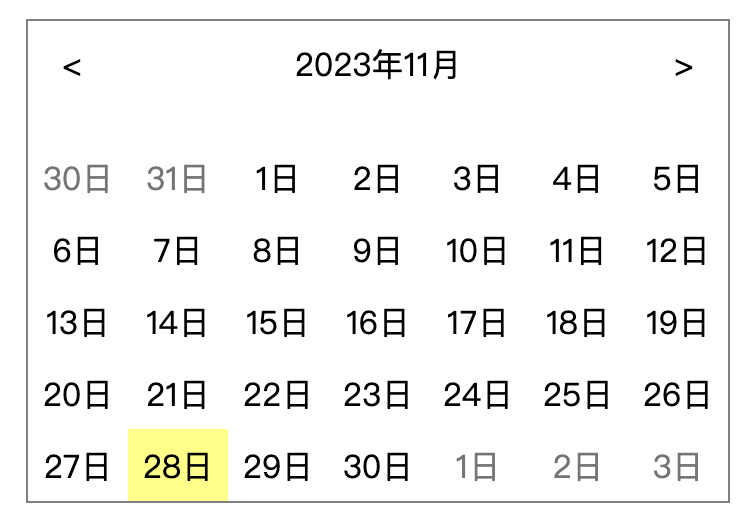

# UI Date Range Picker

UI Date Range Picker 是一個用於選擇日期範圍的 React 組件，並提供靈活且直觀的使用者界面。點擊連結可直接查看[線上展示](https://jasonluo07.github.io/ui-date-range-picker/)。

## 預覽



## 必備條件

node >= 18

## 開始使用

```bash
git clone https://github.com/jasonluo07/ui-date-range-picker
cd ui-date-range-picker
npm install
npm run dev
```

## 測試

使用 Vitest 進行組件的單元測試：

```bash
npm test
```

## 屬性

| 屬性       | 類型     | 描述                                 |
| ---------- | -------- | ------------------------------------ |
| `onChange` | Function | 當選擇的日期範圍改變時觸發的回調函式 |

## 專案結構

```plain
.
└── src
    ├── components
    │   └── DateRangePicker
    │       ├── __tests__
    │       │   └── DateRangePicker.test.tsx
    │       ├── Calendar.module.css
    │       ├── Calendar.tsx
    │       ├── DateButton.module.css
    │       ├── DateButton.tsx
    │       ├── Header.module.css
    │       ├── Header.tsx
    │       ├── index.module.css
    │       └── index.tsx
    ├── utils
    │   └── date.ts
    ├── App.module.css
    ├── App.tsx
    ├── main.tsx
    └── vite-env.d.ts
```
